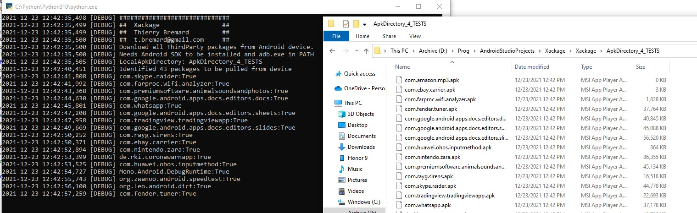

##############################
##  Xackage                 ##
##  Thierry Bremard         ##
##  t.bremard@gmail.com     ##
Download all ThirdParty packages from Android device.
Needs Android SDK to be installed and adb.exe in PATH
Creates a Wrapper of ADB.exe and pull all packages installed.
Do NOT backup private data of application: only APK files are retreived.
Handle only APK of applications on Android
do NOT backup other things like Photo/Contact/Sounds...

# Demo
https://www.youtube.com/watch?v=UT4ZoD5rI2U

Xackage in action:

Example of usage:
Xackage>python main.py pull ApkDirectory_TBR
2021-12-21 11:25:18,672 [DEBUG] ##############################
2021-12-21 11:25:18,672 [DEBUG] ##  Xackage                 ##
2021-12-21 11:25:18,673 [DEBUG] ##  Thierry Bremard         ##
2021-12-21 11:25:18,673 [DEBUG] ##  t.bremard@gmail.com     ##
2021-12-21 11:25:18,673 [DEBUG] Download all ThirdParty packages from Android device.
2021-12-21 11:25:18,673 [DEBUG] Needs Android SDK to be installed and adb.exe in PATH
2021-12-21 11:25:18,677 [DEBUG] LocalApkDirectory: ApkDirectory_TBR
2021-12-21 11:25:20,040 [DEBUG] Identified 78 packages to be pulled from device
2021-12-21 11:25:21,336 [DEBUG] com.skype.raider:True
2021-12-21 11:25:23,546 [DEBUG] com.microsoft.appmanager:True
2021-12-21 11:25:23,711 [DEBUG] com.farproc.wifi.analyzer:True
2021-12-21 11:25:24,288 [DEBUG] com.ebay.kleinanzeigen:True
2021-12-21 11:25:25,582 [DEBUG] com.premiumsoftware.animalsoundsandphotos:True
2021-12-21 11:25:26,424 [DEBUG] com.google.android.apps.docs.editors.docs:True

Xackage>python main.py push ApkDirectory_TBR
2021-12-21 11:27:27,164 [DEBUG] ##############################
2021-12-21 11:27:27,165 [DEBUG] ##  Xackage                 ##
2021-12-21 11:27:27,165 [DEBUG] ##  Thierry Bremard         ##
2021-12-21 11:27:27,165 [DEBUG] ##  t.bremard@gmail.com     ##
2021-12-21 11:27:27,166 [DEBUG] Download all ThirdParty packages from Android device.
2021-12-21 11:27:27,166 [DEBUG] Needs Android SDK to be installed and adb.exe in PATH
2021-12-21 11:27:27,169 [DEBUG] LocalApkDirectory: ApkDirectory_TBR
2021-12-21 11:27:27,170 [DEBUG] Identified 1 packages to be pushed to device
2021-12-21 11:27:34,697 [DEBUG] de.allianz.bonusdriveapp.apk:True
